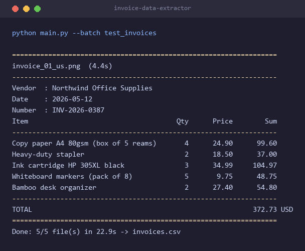

# invoice data extractor

throw a photo or pdf of an invoice or receipt at it and it pulls out the structured data with gemini vision, then drops everything into a csv

## the problem

small businesses retype invoice and receipt data into spreadsheets by hand, 2-3 minutes per doc, mistakes creep in, a stack of 20 receipts eats an hour, and normal ocr chokes on rotated photos or anything that isn't english

## what it does

- one command, `python main.py --input receipt.jpg` or `--batch folder/` for a whole pile
- any layout, any language, no templates - the demo set alone is english, german, russian and uzbek docs across 4 currencies
- strict output, the model is pinned to a json schema so you get clean fields instead of a paragraph, with a retry if a response ever comes back broken
- rotated phone photos are handled by the vision model, multi-page pdfs get rasterized with pymupdf so there's no ffmpeg or poppler to install
- normalizes dates to iso and currency symbols to iso codes (€ turns into EUR, сум into UZS)
- appends to a csv, one row per line item, so it drops straight into a pivot table

## result

ran it live on 5 demo docs (4 languages, 4 currencies, one rotated phone-photo receipt, one 2-page pdf), every field came out right



so roughly 4-6 seconds a doc instead of 2-3 minutes of typing, around 30x faster and it doesn't fat-finger a number

## run it

```
pip install -r requirements.txt
cp .env.example .env          # add your GEMINI_API_KEY, free from https://ai.google.dev
python generate_test_invoices.py
python main.py --batch test_invoices
```

demo docs are fully synthetic, drawn with pillow, no real customer data

## files

```
main.py                     cli, console report, csv writer
extractor.py                gemini call, pdf rasterization, retry logic
models.py                   pydantic schema (also used as the model's response schema)
generate_test_invoices.py   renders the demo docs
```
